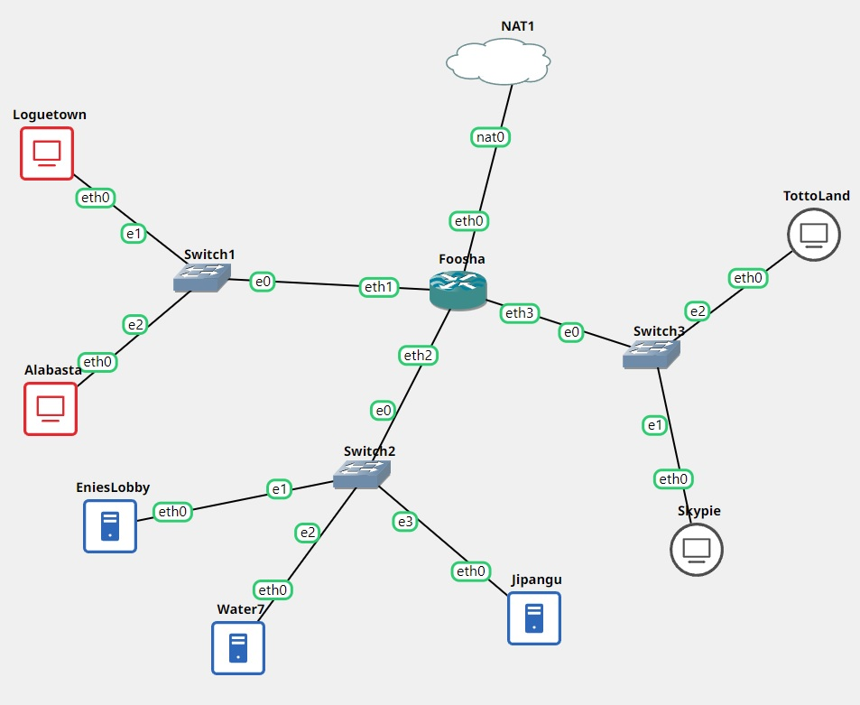
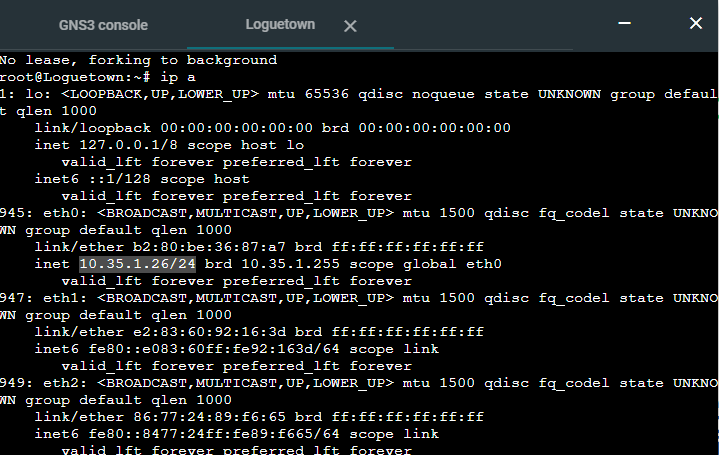
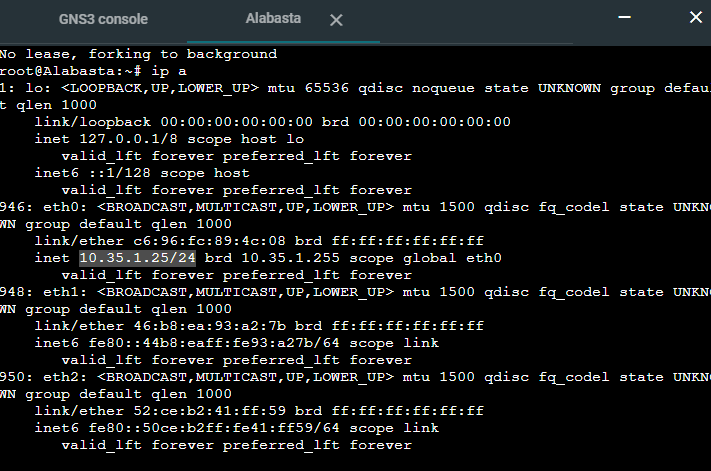
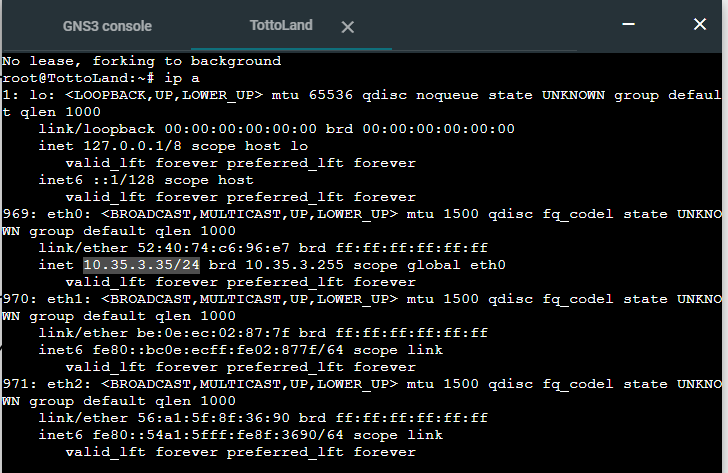
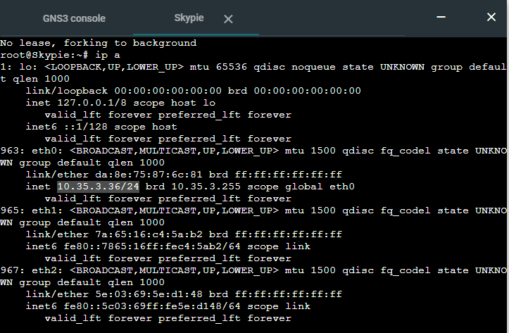

# Jarkom-Modul-3-E12-2021

<hr/>

#### Anggota Kelompok :
 * Rahadian Adjie Mahesa &nbsp;(05111940000221)
 * Ahmad Luthfi Hanif &nbsp; (05111940000179)
 * Afifan Syafaqi Yahya &nbsp; (05111940000234)  

#### Prefix IP 
Address untuk Prefix IP Kelompok kami adalah `10.35`
  
<hr/>
  
## Topologi dan Persiapan

Membuat topologi sebagai berikut:  
  
  
Mengatur _Network Configuration_ pada router `Foosha`, serta node `EniesLobby`. `Water7` dan `Jipangu`. pengaturan config nya sebagai berikut:  
  
1. Foosha  
```
 auto eth0
   iface eth0 inet dhcp

   auto eth1
   iface eth1 inet static
      address 10.35.1.1
      netmask 255.255.255.0

   auto eth2
   iface eth2 inet static
      address 10.35.2.1
      netmask 255.255.255.0

   auto eth3
   iface eth3 inet static
      address 10.35.3.1
      netmask 255.255.255.0
```  
    
2. EniesLobby  
```
   auto eth0
   iface eth0 inet static
      address 10.35.2.2
      netmask 255.255.255.0
      gateway 10.35.2.1
 ```  
   
3. Water7
```
   auto eth0
   iface eth0 inet static
      address 10.35.2.3
      netmask 255.255.255.0
      gateway 10.35.2.1
 ```  
   
4. Jipangu
```
   auto eth0
   iface eth0 inet static
      address 10.35.2.4
      netmask 255.255.255.0
      gateway 10.35.2.1
```  
  
Setelah semua node sudah desettig, lakukan command dibawah ini pada **Foosha** agar dapat mengakses internet.
```
iptables -t nat -A POSTROUTING -o eth0 -j MASQUERADE -s 10.35.0.0/16
```  
Kemudian, jalankan command pada node **EniesLobby**, **Water7**, dan **Jipangu**

```
echo nameserver 192.168.122.1 > /etc/resolv.conf
```  
setalah itu dapat melakukan update pada node tersebut atau intallasi package lainnya karena sudah terakses oleh internet.  
  
## Soal 1  
  
Luffy bersama Zoro berencana membuat peta tersebut dengan kriteria EniesLobby sebagai DNS Server, Jipangu sebagai DHCP Server, Water7 sebagai Proxy Server.  
  
**Pembahasan:**  
1. Intalasi ISC DHCP Server pada node **Jipangu** menggunakan command berikut:  
```
apt-get update
apt-get intall isc-dhcp-server -y
```  
Setlah itu, pastikan ISC DHCP server sudah teristall dengan menggunakan command `dhcpd --version`.  
  
2. Konfigurasi DHCP server pada **Jipangu** dengan meng-edit file konfigurasi _isc-dhcp-server_.
```
nano /etc/default/isc-dhcp-server
```  
Lalu, edit beberapa hal pada file tersebut. Pada interface yang diberikan layanan DHCP adalah **eth0**. Maka, pada bagian baris akhir di file `/etc/default/isc-dhcp-server` diubah menjadi
```
INTERFACES = "eth0"
```  
  
3. Konfigurasi Proxy Server pada node **Water7** yaitu install dan update terlebih dahulu package yang akan kita gunakan menggunakan command berikut:  
```
apt-get update
apt-get install squid -y
```  
untuk memastikan proxy server sudah ter-install dengan mengecek status squid tersebut apakah sudah _running_ menggunakan command 
```
service squid status
```  
Backup file konfigurasi default bawaan yang telah disediakan Squid dengan command:  
```
mv /etc/squid/squid.conf /etc/squid/squid.conf.bak
```  
Lalu, buat konfigurasi squid baru pada file tersebut.
```
nano /etc/squid/squid.conf
```  
Kemudian tambahkan
```
http_port 8080
visible_hostname Water7
```  
Setalah  itu, restart Suid tersebut menggunakan command `service squid restart` dan pastikan status Squid telah **OK**.  
  
## Soal 2
  
Foosha sebagai DHCP Relay  
  
**Pembahasan:**  
  
1. Instalasi ISC-DHCP-Relay pad router **Foosha** dengan melakukan commadn sebagai berikut:  
```
apt-get update
apt-get install isc-dhcp-relay
```  
Saat intalasi berlangsung, kita diminta untuk input `SERVER` yang akan kita isin dengan IP dari **Jipnagu**. ketik sebagai berikut:  
```
10.35.2.4
```  
Kemudain, diminta lagi unruk menginputkan `INTERFECES`, ketik sebagai berikut:  
```
eth1 eth2 eth3
```  
Setelah itu, bila ada hal yang diminta input lagi, lewati saja dengan klik tombol ENTER pada keyboard.  
**ATAU**  
Dapat diubah juga dengan mengedit file konfogurasinya _/etc/default/isc-dhcp-relay_. Dengan isi yang dapat diubah pada bagian `SERVERS` dan `INTERFACES` sebagaimana berikut:  
```
      # Defaults for isc-dhcp-relay initscript
      # sourced by /etc/init.d/isc-dhcp-relay
      # installed at /etc/default/isc-dhcp-relay by the maintainer scripts

      #
      # This is a POSIX shell fragment
      #

      # What servers should the DHCP relay forward requests to?
      SERVERS="10.36.2.4"

      # On what interfaces should the DHCP relay (dhrelay) serve DHCP requests?
      INTERFACES="eth1 eth2 eth3"

      # Additional options that are passed to the DHCP relay daemon?
      OPTIONS=""
```  
  
## Soal 3-6  
  
- **No 3**
  Client yang melalui Switch1 mendapatkan range IP dari 10.36.1.20 - 10.36.1.99 dan 10.36.1.150 - 10.36.1.169  
- **No 4**
  Client yang melalui Switch3 mendapatkan range IP dari 10.36.3.30 - 10.36.3.50  
- **No 5** Client mendapatkan DNS dari EniesLobby dan client dapat terhubung dengan internet melalui DNS tersebut.  
- **No 6** Lama waktu DHCP server meminjamkan alamat IP kepada Client yang melalui Switch1 selama 6 menit sedangkan pada client yang melalui Switch3 selama 12 menit. Dengan waktu maksimal yang dialokasikan untuk peminjaman alamat IP selama 120 menit.  
  
**Pembahasan:**  

1. install `bind9` pada **EniesLobby** dan jadikan sebagai DNS Forwarders dengn commdan sebagai berikut:  
```
apt-get update
apt-get install bind9 -y
```  
Lalu, Edit file _/etc/bind/named.conf.options_ pada server **EniesLobby** dengan uncomment pada:  
```
forwarders {
  192.168.122.1;
};
```  
Dan edit dan tambah sebagai berikut:  
```
//dnssec-validation auto;
allow-query{any;};
```  
  
2. Setting DHCP Server pada **Jipangu** dengan mengedit isi file pada _/etc/dhcp/dhcpd.conf_ menggunakan command `nano /etc/dhcp/dhcpd.conf`. lalu tambahkan script sebagai berikut:  
```
subnet 10.36.2.0 netmask 255.255.255.0{
}

subnet 10.36.1.0 netmask 255.255.255.0{
         range 10.36.1.20 10.36.1.99;
         range 10.36.1.150 10.36.1.169;
         option routers 10.36.1.1;
         option broadcast-address 10.36.1.255;
         option domain-name-servers 10.36.2.2;
         default-lease-time 360;
         max-lease-time 7200;
}

subnet 10.36.3.0 netmask 255.255.255.0{
         range 10.36.3.30 10.36.3.50;
         option routers 10.36.3.1;
         option broadcast-address 10.36.3.255;
         option domain-name-servers 10.36.2.2;
         default-lease-time 720;
         max-lease-time 7200;
}
```  
  
**Keterangan :** <br>
a. **Jawaban dari No 3** (Switch 1)
```
     range 10.36.1.20 10.36.1.99;
     range 10.36.1.150 10.36.1.169;
```  
b. **Jawaban dari No 4** (Switch 3)

```
     range 10.36.3.30 10.36.3.50;
```  
c. **Jawaban dari No 6**  
- Switch 1
 ```
       default-lease-time 360;
       max-lease-time 7200;
```  
- Switch 3
```
        default-lease-time 720;
        max-lease-time 7200;
```  
  
Setelah semua sudah teredit, laukan restart DHCP server menggunakan command:  
```
service isc-dhcp-server restart
```  
  
3. Testing pada node Client (**Loguetown**, **Alabasta**, **TottoLand**, dan **Skypie**) dengan mengedit _Network Configuration_ pada tiap node client menjadi sebagai berikut:  
```
auto eth0
iface eth0 inet dhcp
```  
Kemudian, restart setiap client dengan cara buka GNS3 → klik kanan node → klik Stop → klik kanan kembali node → klik Start. Lalu periksa IP pada setiap node dengan command:  
```
ip a
```  
  
a. Loguetown  
  
b. Alabasta  
  
c. TottoLand  
  
d. Skypie  
  
  
  
## Soal 7
